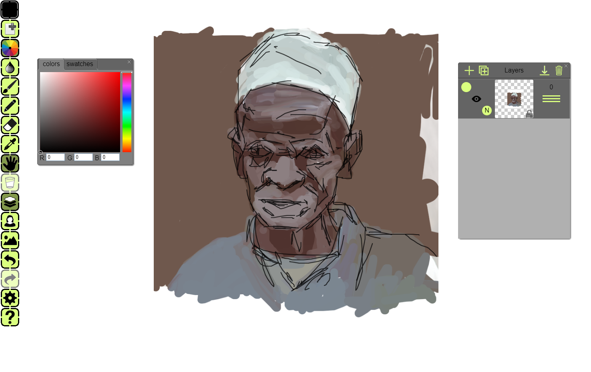

Paletta is digital painting software that simulates oil painting via a proprietary color mixing algorithm.

This software was implemented completly using HTML5, Javascript, and CSS,  and leverages Just-in-time compilation in the browser to deliver hight-speed rendering. 

You can save your art work on your device and also export it on social media. 

The application has support for a traditional mouse input or touch, but you can also use digital styluses including Wacom stylus, Surface pen, and the IPAD pencil with pressure sensitivity.

This was a fun project of mine for teaching my daughter how to mix colors :-).

[click here to draw!](https://blaisetine.github.io/paletta)
